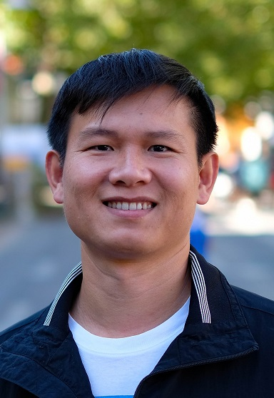

About
=====

My name is Nhut Nguyen. I am a C++ Software Developer in Copenhagen, Denmark.

I was born and grew up in Ho Chi Minh City, Vietnam. In 2012, I moved to Denmark for a Ph.D. in mathematics at the Technical University of Denmark. After the study, I switched to the industry in 2016 and have worked at various tech companies in Copenhagen, Denmark.

I love to share my experience and lessons I learned from my life and work through books and articles.

Subscribe to my email newsletter to get updates from my journey. You can also follow me on Facebook and LinkedIn.

.. toctree::

   blogs/index
   books
